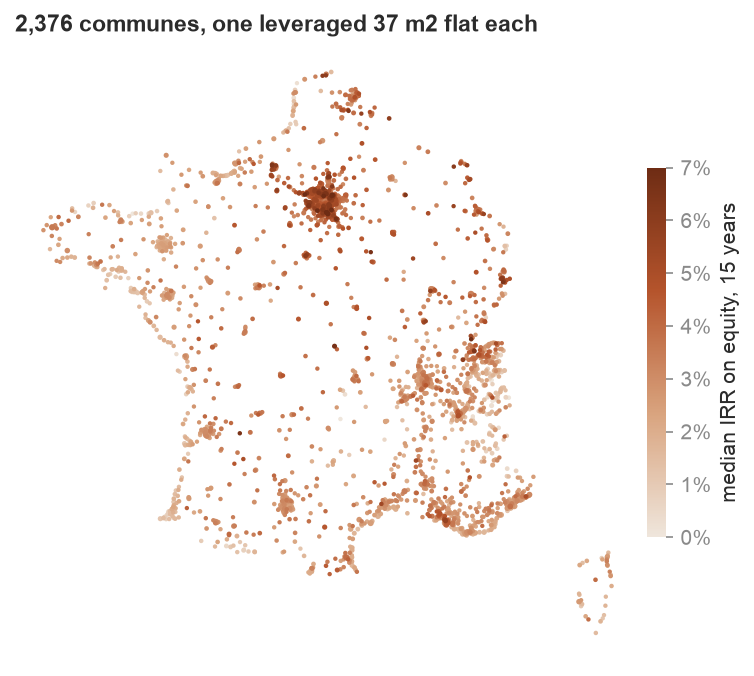
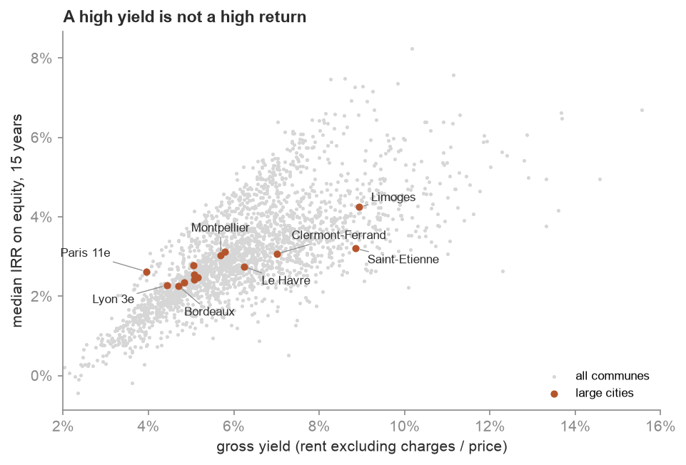
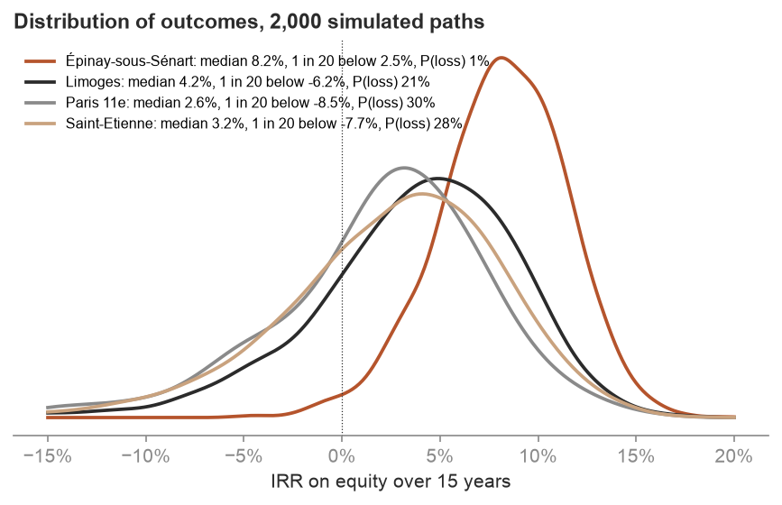
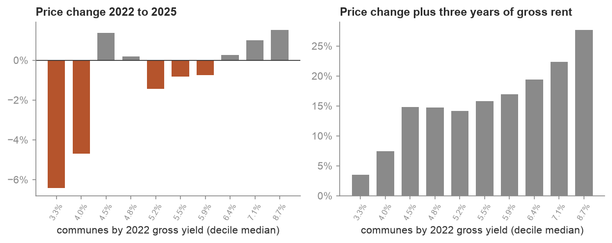

*[English version](README.md)*

# Risque et rendement de l'investissement locatif dans chaque commune française, sur données ouvertes

`immorisk` répond à une question que banques et investisseurs se posent tous les jours : si j'achète un petit appartement à louer, à crédit, où est-ce rentable en France, et combien puis-je perdre ? Le projet valorise le même T2 de 37 m2 dans 2 376 communes à partir de 1,8 million de ventes réelles, avec les vrais loyers, la vacance et les étiquettes énergétiques. Il déroule ensuite 15 ans de flux après impôt selon la fiscalité française, 2 000 fois par commune, dans un modèle de marché calibré sur 34 ans d'indices INSEE.

Tout vient de données ouvertes, reliées par code INSEE : ventes DVF, carte des loyers, vacance LOVAC, diagnostics énergétiques de l'ADEME, périmètres des quartiers prioritaires et indices INSEE. Aucune donnée synthétique n'entre dans la chaîne.



## Principaux résultats

L'investisseur apporte 10 % du prix plus les frais et emprunte le reste sur 20 ans à 3,2 %. Sa tranche marginale d'imposition est de 30 % et il confie la gestion à une agence. Chaque commune reçoit le mode de location qui lui convient le mieux. Sur 15 ans, avec des prix supposés croître de 1,5 % par an à long terme :

- Le **TRI médian sur fonds propres est de 3,0 %** d'une commune à l'autre, de 1,7 % (10e centile) à 4,7 % (90e).
- La **probabilité médiane de perdre de l'argent est de 30 %**.
- L'investisseur médian apporte **21 700 EUR** à l'achat, puis **270 EUR par mois** pendant les cinq premières années.

**Les grandes villes**, par TRI médian :

| Ville | EUR/m2 | Loyer EUR/m2 | Rendement brut | Rendement net | Meilleur régime | TRI médian | 1 fois sur 20 sous | P(perte) | Effort EUR/mois | Classés F ou G | Rang /2 376 |
|---|---:|---:|---:|---:|---|---:|---:|---:|---:|---:|---:|
| Limoges | 1 596 | 13,4 | 8,9 % | 4,5 % | nu, au réel | **4,2 %** | -6,2 % | 21 % | 129 | 4 % | 400 |
| Saint-Étienne | 1 347 | 11,4 | 8,9 % | 4,0 % | nu, au réel | **3,2 %** | -7,7 % | 28 % | 128 | 10 % | 994 |
| Marseille 5e | 3 553 | 18,6 | 5,8 % | 3,3 % | nu, au réel | **3,1 %** | -8,2 % | 30 % | 349 | 4 % | 1 054 |
| Clermont-Ferrand | 2 225 | 14,5 | 7,0 % | 3,7 % | nu, au réel | **3,1 %** | -7,0 % | 27 % | 212 | 9 % | 1 110 |
| Montpellier | 3 460 | 17,9 | 5,7 % | 3,4 % | nu, au réel | **3,0 %** | -8,0 % | 30 % | 334 | 2 % | 1 139 |
| Nice | 5 049 | 22,7 | 5,0 % | 3,1 % | nu, au réel | **2,8 %** | -8,6 % | 31 % | 509 | 5 % | 1 371 |
| Le Havre | 2 387 | 13,9 | 6,2 % | 3,2 % | nu, au réel | **2,7 %** | -8,7 % | 31 % | 246 | 9 % | 1 392 |
| Paris 11e | 9 641 | 33,3 | 4,0 % | 2,6 % | meublé (LMNP) | **2,6 %** | -8,5 % | 30 % | 1 078 | 19 % | 1 513 |
| Nantes | 3 563 | 16,6 | 5,1 % | 2,9 % | nu, au réel | **2,5 %** | -9,1 % | 34 % | 373 | 5 % | 1 583 |
| Toulouse | 3 455 | 16,3 | 5,1 % | 2,9 % | nu, au réel | **2,5 %** | -8,5 % | 33 % | 362 | 4 % | 1 647 |
| Lille | 3 930 | 18,1 | 5,1 % | 2,9 % | nu, au réel | **2,4 %** | -9,6 % | 34 % | 418 | 8 % | 1 683 |
| Rennes | 3 892 | 17,2 | 4,8 % | 2,8 % | nu, au réel | **2,3 %** | -9,3 % | 33 % | 414 | 5 % | 1 746 |
| Lyon 3e | 4 710 | 18,9 | 4,4 % | 2,7 % | nu, au réel | **2,3 %** | -9,9 % | 35 % | 519 | 6 % | 1 797 |
| Bordeaux | 4 350 | 18,5 | 4,7 % | 2,7 % | nu, au réel | **2,3 %** | -9,7 % | 35 % | 474 | 6 % | 1 809 |

Les prix sont ceux du bien de référence (37 m2, deux pièces, hors quartier prioritaire). Les loyers sont les loyers d'annonce de la carte des loyers, charges comprises. Le rendement net s'entend après vacance et toutes les charges courantes, avant crédit et impôt. « 1 fois sur 20 sous » est le quantile à 5 % du TRI.

**Le haut du classement.** Les dix premières ont toutes au moins 30 ventes d'appartements par an :

| Rang | Commune | Ventes/an | En QPV | EUR/m2 | Rendement brut | TRI médian | 1 fois sur 20 sous | P(perte) | Rang, plage à 90 % |
|---:|---|---:|---:|---:|---:|---:|---:|---:|---|
| 1 | Épinay-sous-Sénart (91) | 56 | 45 % | 2 299 | 10,2 % | **8,2 %** | 2,5 % | 1 % | 1 à 1 |
| 2 | Grigny (91) | 65 | 81 % | 1 861 | 11,1 % | **7,6 %** | 0,0 % | 5 % | 2 à 5 |
| 3 | Villepinte (93) | 134 | 42 % | 2 987 | 8,6 % | **7,5 %** | 0,1 % | 5 % | 2 à 6 |
| 4 | Villeneuve-la-Garenne (92) | 84 | 26 % | 3 695 | 8,3 % | **7,5 %** | 0,2 % | 5 % | 2 à 6 |
| 5 | Aubergenville (78) | 58 | 0 % | 2 298 | 9,8 % | **7,4 %** | 0,7 % | 3 % | 3 à 8 |
| 6 | Évry-Courcouronnes (91) | 411 | 24 % | 2 582 | 9,0 % | **7,3 %** | 0,6 % | 4 % | 5 à 8 |
| 7 | Les Ulis (91) | 146 | 3 % | 2 642 | 8,8 % | **7,3 %** | 1,4 % | 2 % | 4 à 9 |
| 8 | Ris-Orangis (91) | 179 | 37 % | 2 457 | 9,3 % | **7,2 %** | 1,3 % | 3 % | 6 à 9 |
| 9 | Sevran (93) | 128 | 38 % | 2 700 | 8,7 % | **6,9 %** | -0,5 % | 6 % | 9 à 13 |
| 10 | Prémanon (39) | 31 | 0 % | 2 920 | 9,1 % | **6,9 %** | -1,2 % | 7 % | 6 à 20 |

Les gagnantes sont les communes de grande banlieue parisienne, où les loyers approchent ceux de Paris mais pas les prix. Plusieurs ont une forte part de ventes en quartier prioritaire (QPV). Là, la qualité des copropriétés, le risque locataire et la liquidité à la revente portent des risques que le modèle ne chiffre pas. Elles sont signalées plutôt qu'écartées en silence, et l'application les filtre d'un seul curseur.

Ce que disent les résultats :

- **Un fort rendement brut n'est pas une forte rentabilité.** Seules 10 des 50 communes au meilleur rendement brut entrent dans le top 50 par TRI. Saint-Étienne affiche 8,9 % brut, comme Limoges, mais rapporte un point de moins. Son marché est détendu (trois mois de vide entre deux locataires) et les coûts fixes au m2 (taxe foncière, charges de copropriété, entretien) pèsent bien plus sur un appartement bon marché.

  

- **Avec l'effet de levier, le résultat se joue en bonne partie sur les prix.** Paris 11e a un TRI médian de 2,6 %, de 0,1 % si les prix stagnent et de 4,8 % s'ils montent de 3 % par an. Sa probabilité de perte passe de 30 % à 49 % avec des prix plats. L'inertie des prix immobiliers (coefficient AR(1) trimestriel de 0,75 à 0,85) étale fortement les résultats à 15 ans.

  

- **Le régime fiscal compte autant que la ville.** Le micro-foncier impose 70 % des loyers et ignore les intérêts : il ramène le TRI autour de 0 % partout. Au réel, un investisseur endetté fait des pertes les premières années. En location nue, la part hors intérêts de ce déficit s'impute sur le revenu global jusqu'à 10 700 EUR par an. En meublé (LMNP), le déficit ne fait que se reporter, et l'amortissement ne sert à rien tant que le résultat est négatif. La location nue au réel l'emporte dans 84 % des communes. Le LMNP gagne dans 16 %, surtout les plus chères (médiane de 3 841 EUR/m2 contre 2 716).

  | Ville | Micro-foncier | Nu, au réel | Meublé (LMNP) |
  |---|---:|---:|---:|
  | Paris 11e | 0,5 % | 2,5 % | **2,6 %** |
  | Nice | 0,5 % | **2,8 %** | 2,8 % |
  | Lyon 3e | -0,1 % | **2,3 %** | 1,9 % |
  | Saint-Étienne | -0,6 % | **3,2 %** | 0,8 % |
  | Limoges | 0,8 % | **4,2 %** | 2,9 % |

- **Quand les taux ont monté, les marchés chers se sont comportés comme des obligations longues.** Le backtest classe les communes selon leur rendement brut 2022 (carte des loyers 2022, ventes 2021-2022) et mesure leur évolution de prix jusqu'en 2025. Le décile au plus faible rendement a perdu 6,4 %, celui au plus fort a gagné 1,5 %. La pente au sein de chaque département vaut 0,033 (écart-type 0,009). Un seul choc de taux ne fait pas une loi, donc ce résultat est rapporté mais n'entre pas dans la simulation.

  

- **Les interdictions de louer les passoires touchent plus Paris que sa banlieue.** À Paris 11e, 19 % des appartements diagnostiqués sont classés F ou G (les petites surfaces anciennes sont mal notées). À Évry-Courcouronnes, c'est 2 %. Un logement G ne peut plus être loué depuis 2025, un F à partir de 2028 et un E à partir de 2034. La simulation tire l'étiquette du bien selon la répartition de la commune et paie les travaux avant chaque échéance.

## Comment ça marche

| Source | Ce qu'elle donne | Usage |
|---|---|---|
| DVF 2021-2025 (fichiers géolocalisés Etalab) | 1 812 404 ventes d'un seul appartement après nettoyage | niveaux de prix, risque local, backtests |
| Carte des loyers 2025 et 2022 (ANIL) | loyer d'annonce au m2 d'un T1-T2, avec intervalle de prédiction à 95 % | niveau de loyer et loyer d'un bien donné |
| LOVAC 2026 (Cerema) | logements privés vacants, et vacants depuis plus de deux ans | mois de vide entre deux locataires |
| DPE ADEME depuis juillet 2021 | 9,7 millions de diagnostics d'appartements, par étiquette | risque d'interdiction de louer |
| Périmètres QPV 2024 (ANCT) | 1 580 quartiers prioritaires | modèle de prix et signalement |
| Indices notaires-INSEE et IRL, 1992-2026 | prix trimestriels des appartements dans quatre zones, indice des loyers | risque de marché |

Données de loyers : « Estimations ANIL, à partir des données du Groupe SeLoger et de leboncoin ».

**1. Nettoyage des ventes** (`immorisk/data.py`). DVF compte une ligne par vente, parcelle et local, et répète le prix de la vente sur chaque ligne. On garde les ventes simples d'un seul appartement, avec cave ou parking éventuels. On écarte les lots de plusieurs appartements, les appartements vendus avec un commerce, les VEFA, les adjudications, les lignes en double et les 1 % extrêmes du prix au m2 de chaque département. Chaque vente est située dans un quartier prioritaire ou en dehors (point dans polygone, 0,6 seconde pour 1,8 million de points).

**2. Modèle de prix hédonique** (`immorisk/prices.py`). La régression s'écrit

`log(prix/m2) = indice[département, trimestre] + niveau[commune] + surface et pièces + QPV[zone] + e`

Elle est estimée par backfitting des deux jeux d'effets fixes, sur 975 000 ventes de 2023 à 2025, avec des résidus écrêtés à trois écarts-types. Les petites surfaces coûtent plus cher au m2 (élasticité de -0,14). Un appartement en quartier prioritaire se vend 15 % sous un bien comparable à Paris, 18 % en banlieue et 28 % ailleurs. Le bien de référence est valorisé hors quartier prioritaire.

**3. Estimation sur petits domaines** (Fay-Herriot, la méthode des instituts statistiques pour les petites zones). Une commune avec 12 ventes a un prix bruité. Chaque estimation directe est vue comme la vraie valeur plus un bruit d'échantillonnage connu. La vraie valeur est modélisée comme une moyenne départementale plus un effet loyer plus un écart propre à la commune, et chaque commune est ramenée vers cette prédiction en proportion de son bruit. Au sein d'un département, 1 % de loyer en plus donne 1,54 % de prix en plus, donc le rendement baisse quand le marché renchérit. Hors échantillon (niveaux estimés sur les ventes 2023-2024, vérifiés sur les ventes 2025 jamais vues), le meilleur prédicteur linéaire sans biais empirique (EBLUP) réduit l'erreur de 7 % à 13 % pour les communes de 4 à 20 ventes :

| Ventes 2023-2024 | Communes | RMSE directe | RMSE EBLUP | Baisse de l'erreur |
|---|---:|---:|---:|---:|
| 4-6 | 14 | 11,2 % | 9,7 % | 13 % |
| 7-10 | 29 | 6,9 % | 6,3 % | 8 % |
| 11-20 | 238 | 8,1 % | 7,6 % | 7 % |
| 21-50 | 758 | 5,9 % | 5,6 % | 4 % |
| 51 et plus | 1 438 | 4,0 % | 4,0 % | 1 % |

**4. Loyers, vacance et énergie** (`immorisk/universe.py`).
- **Loyer.** C'est la valeur de la carte moins 1,5 EUR/m2 de charges récupérables. La largeur de l'intervalle de prédiction à 95 % (environ +/-23 %) donne la dispersion des loyers qu'un bien peut obtenir.
- **Vacance.** Les mois de vide entre deux locataires vont de 1 dans le marché le plus tendu à 3 dans le plus détendu. Les marchés sont classés selon la part de logements vides depuis plus de deux ans. Le taux de vacance de courte durée n'est pas utilisé : il est maximal dans les grandes villes, où les locataires bougent souvent mais où l'on reloue vite.
- **Énergie.** Les parts E, F et G viennent des diagnostics ADEME. Les communes peu diagnostiquées sont ramenées vers leur département (bêta-binomiale).

**5. Modèle de marché** (`immorisk/market.py`).
- **Prix par zone.** Les rendements trimestriels en log des quatre indices INSEE des appartements (Paris, petite couronne, grande couronne, province) suivent des AR(1) aux chocs corrélés. La persistance va de 0,75 à 0,85, et les volatilités trimestrielles de 0,8 % à 1,2 %.
- **Loyers.** L'indice de référence des loyers (IRL) fait partie du même système et n'est presque pas corrélé aux prix.
- **Croissance.** La croissance de long terme est un scénario (1,5 % par an pour les prix, 1,8 % pour les loyers) : 30 ans d'historique, dont la bulle de 1998-2007, disent peu des 15 prochaines années. La simulation part des quatre derniers trimestres, donc l'élan actuel se prolonge sur les premières années.
- **Risque local.** Départements et communes s'écartent de leur zone par des marches aléatoires. La volatilité départementale est de 1,8 % par an, mesurée par l'écart entre l'indice DVF de chaque département et sa zone INSEE, net du bruit d'échantillonnage. La volatilité communale est de 2,4 % par an, mesurée par la dispersion des évolutions 2022-2025 des communes autour de leur département, nette du bruit d'estimation.

**6. Flux et fiscalité** (`immorisk/finance.py`, `immorisk/simulate.py`).
- **Achat et crédit.** Le crédit est amortissable à mensualités constantes, avec assurance emprunteur et frais de caution. Les frais de notaire sont de 8 %. Une revente avant l'échéance déclenche les indemnités de remboursement anticipé.
- **Charges courantes.** Elles comprennent les charges de copropriété, la taxe foncière, l'assurance PNO, la gestion (7 %), l'entretien et les frais de relocation au plafond légal. En meublé s'ajoutent l'expert-comptable et la CFE au-delà de 5 000 EUR de recettes.
- **Travaux énergétiques.** Ils sont payés l'année de l'interdiction. Le bien est acheté avec une décote liée à son étiquette et revendu à la valeur d'un D une fois rénové.
- **Fiscalité.** Trois régimes sont modélisés :
  - micro-foncier ;
  - location nue au réel : le déficit foncier s'impute sur le revenu global jusqu'à 10 700 EUR, la part due aux intérêts ne fait que se reporter, et les déficits expirent au bout de dix ans ;
  - LMNP : l'amortissement de l'immeuble, des frais d'acquisition, du mobilier et des travaux ne peut pas créer de déficit, et l'amortissement non utilisé se reporte.
- **Plus-value.** Elle bénéficie des abattements pour durée de détention (exonération d'impôt après 22 ans, de prélèvements sociaux après 30). En LMNP, les amortissements déduits sont réintégrés dans la plus-value (loi de finances 2025).

**7. Monte Carlo et classement** (`immorisk/simulate.py`, `immorisk/rank.py`).
- **Tirages.** Chaque commune reçoit 2 000 trajectoires. Chacune tire le vrai niveau de prix (selon la loi a posteriori de Fay-Herriot), le loyer du bien, son étiquette énergétique, la rotation des locataires et la vacance, ainsi que les trajectoires de prix locales.
- **Nombres aléatoires communs.** Les trajectoires de zone et de loyer sont communes à toutes les communes, donc les écarts entre communes ne sont pas du bruit de simulation. Les tirages propres à chaque commune sont initialisés par son code INSEE, donc le résultat ne dépend pas du découpage en lots.
- **Choix du régime.** Chaque commune est louée sous le régime au TRI espéré le plus élevé.
- **Plages de rang.** Une plage à 90 % s'obtient en retirant 200 fois chaque niveau de prix selon sa loi a posteriori et en reclassant.
- **Temps de calcul.** Le calcul complet (2 376 communes, 4,75 millions d'investissements simulés) prend environ une minute.

## Scénarios

TRI médian, avec la probabilité de perte entre parenthèses :

| Ville | Central | Prix stables | Prix +3 % | Crédit 4,2 % | Crédit 2,5 % | 10 ans | 20 ans | Sans agence |
|---|---:|---:|---:|---:|---:|---:|---:|---:|
| Paris 11e | 2,6 % (30 %) | 0,1 % (49 %) | 4,8 % (18 %) | 1,7 % (40 %) | 3,4 % (24 %) | 0,9 % (46 %) | 3,4 % (18 %) | 3,2 % (26 %) |
| Lyon 3e | 2,3 % (35 %) | -0,6 % (54 %) | 4,5 % (20 %) | 1,4 % (41 %) | 2,8 % (32 %) | 0,4 % (49 %) | 2,6 % (22 %) | 2,6 % (33 %) |
| Bordeaux | 2,3 % (35 %) | -0,7 % (55 %) | 4,5 % (19 %) | 1,4 % (41 %) | 2,8 % (31 %) | 0,4 % (48 %) | 2,7 % (26 %) | 2,7 % (32 %) |
| Limoges | 4,2 % (21 %) | 1,6 % (39 %) | 6,5 % (10 %) | 3,5 % (26 %) | 4,8 % (18 %) | 2,9 % (37 %) | 4,4 % (12 %) | 5,1 % (16 %) |
| Saint-Étienne | 3,2 % (28 %) | 0,5 % (46 %) | 5,3 % (14 %) | 2,4 % (35 %) | 3,7 % (25 %) | 1,4 % (44 %) | 3,6 % (18 %) | 3,9 % (24 %) |

Garder le bien dix ans au lieu de quinze ajoute 14 à 16 points à la probabilité de perte : les frais d'achat ne sont pas encore amortis, et les abattements sur la plus-value commencent à peine.

## Limites

- **Loyers.** Ce sont des loyers d'annonce, pas des loyers signés, et l'encadrement des loyers n'est pas appliqué. Paris, Lyon, Lille, Bordeaux, Montpellier et une partie de la banlieue parisienne plafonnent les loyers, donc ces villes peuvent paraître un peu meilleures qu'elles ne le sont.
- **Croissance des prix.** C'est un scénario. Le modèle estime la dynamique et la dispersion, pas la tendance de long terme.
- **Copropriétés.** Leur qualité n'est pas observée. Les charges sont les mêmes au m2 partout, et le registre national des copropriétés ne publie plus les procédures, donc les copropriétés en difficulté ne peuvent pas être repérées. La part de quartier prioritaire sert d'indicateur de substitution.
- **Énergie.** Les diagnostics depuis juillet 2021 précèdent le changement de coefficient de l'électricité de 2026, qui a fait sortir de F et G une partie des logements chauffés à l'électricité. Coûts de travaux et décotes par étiquette sont des ordres de grandeur, fixés en paramètres.
- **Vacance.** Le passage de la vacance longue aux mois de vide entre locataires est calibré, pas estimé.
- **Couverture.** L'Alsace-Moselle n'est pas dans DVF, et l'outre-mer est laissé de côté.
- **Fiscalité.** Le modèle n'applique pas de surtaxe sur les grosses plus-values, et les prélèvements sociaux sont fixés à 17,2 %.

## Lancer le projet

```bash
python -m venv .venv && source .venv/bin/activate
pip install -e ".[app,dev]"
immorisk run          # télécharge une fois environ 600 Mo de données ouvertes, puis simule chaque commune (environ une minute)
immorisk report       # graphiques dans out/charts
immorisk commune Limoges --regime reel --rate 0.035
streamlit run app/streamlit_app.py
pytest
```

L'application classe toutes les communes avec des filtres (zone, liquidité, quartiers prioritaires, prix) sur une carte. Elle simule aussi une commune en direct avec votre tranche d'imposition, votre crédit, votre apport, votre horizon et votre scénario de prix, et affiche la distribution des résultats et les flux année par année.

## Organisation

```
immorisk/
  config.py     toutes les hypothèses au même endroit (dataclasses)
  data.py       téléchargements et chargements : DVF, carte des loyers, LOVAC, DPE, QPV, INSEE
  prices.py     modèle hédonique et estimation Fay-Herriot sur petits domaines
  universe.py   jointure de tout par code INSEE
  market.py     modèle de marché AR(1) : calibration, simulation
  finance.py    crédit, fiscalité locative française, plus-value, TRI
  simulate.py   Monte Carlo des flux, choix du régime
  rank.py       plages de rang sous incertitude d'estimation
  backtest.py   vérifications hors échantillon
  pipeline.py   exécution complète, écrit out/results.json et out/communes.csv
  report.py     graphiques
app/            application Streamlit
tests/          35 tests : fiscalité, crédit, TRI, estimateurs, modèle de marché, identités de flux
```
